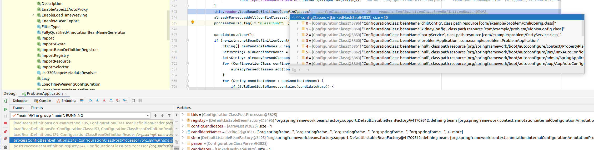
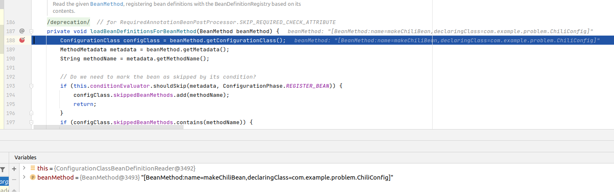
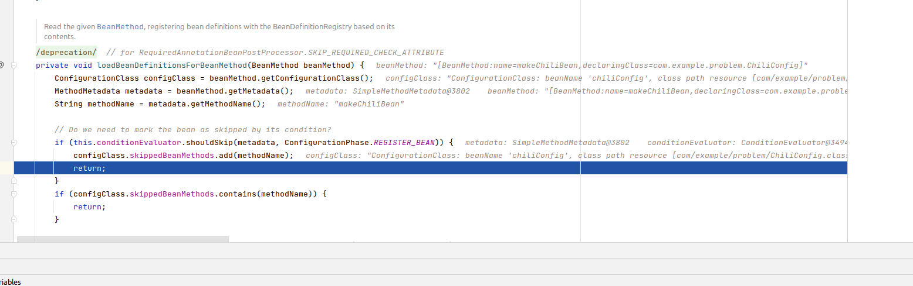

# Problem demo

This application is a demo for a problem when applying
@ConditionalOnProperty on @Bean methods in a @Configuration class.

See [Spring boot issue 26954](https://github.com/spring-projects/spring-framework/issues/26954)

In here we set up two beans and one Service, on depends on the next.

PartyService (@Service) depends on ChiliConCarne (@Bean) depends on KidneyBean (@Bean)

As a tasty spice we added @ConditionalOnBean on the ChiliConCarne Bean factory method.

When we try to start the application it fails: The ChiliConfig will be evaluated before the KidneyConfig, so the @ConditionalOnBean on the ChiliConfig returns false - there isn't a KidneyBean, yet.

Refactoring and just renaming the KidneyConfig to AAAKidneyConfig makes things work, because now AAAKidneyConfig is evaluated in front of ChiliConfig, so when ChiliConfig's @ConditionalOnBean is run, then the KidneyBean will exist.

See the branch [working](https://github.com/froh42/spring-issue-demo-26964/tree/working) for the version with the renamed config. That one starts up. 

If both Configuration classes are in different namespaces things get even more strange, it looks like it is dependent on luck (or dirent ordering in the filesystem) whether one or the other config is parsed first - making startup nondeterministic and dependent on chance.

# Analysis

I do think the key location to understand the problem is during startup:

    loadBeanDefinitionsForBeanMethod:195, ConfigurationClassBeanDefinitionReader (org.springframework.context.annotation)
    loadBeanDefinitionsForConfigurationClass:153, ConfigurationClassBeanDefinitionReader (org.springframework.context.annotation)
    loadBeanDefinitions:129, ConfigurationClassBeanDefinitionReader (org.springframework.context.annotation)
    processConfigBeanDefinitions:343, ConfigurationClassPostProcessor (org.springframework.context.annotation)
    postProcessBeanDefinitionRegistry:247, ConfigurationClassPostProcessor (org.springframework.context.annotation)
    invokeBeanDefinitionRegistryPostProcessors:311, PostProcessorRegistrationDelegate (org.springframework.context.support)
    invokeBeanFactoryPostProcessors:112, PostProcessorRegistrationDelegate (org.springframework.context.support)
    invokeBeanFactoryPostProcessors:746, AbstractApplicationContext (org.springframework.context.support)
    refresh:564, AbstractApplicationContext (org.springframework.context.support)
    refresh:782, SpringApplication (org.springframework.boot)
    refresh:774, SpringApplication (org.springframework.boot)
    refreshContext:439, SpringApplication (org.springframework.boot)
    run:339, SpringApplication (org.springframework.boot)
    run:1340, SpringApplication (org.springframework.boot)
    run:1329, SpringApplication (org.springframework.boot)
    main:20, ProblemApplication (com.example.problem)

The application will start, the `ApplicationContext` will `refresh()`, the `ConfigurationClassPostProcessor` will scan the 
`@Configuration` classes and use the `ConfigurationClassBeanDefinitionReader` to generate `BeanDefinition`s for each
method marked up with `@Bean`.

Looking at the stack frame for `processConfigBeanDefinitions` we can see that we have a number of `@Configuration`s
to load in our sample:

Aha, in this list we have the `ChiliConfig` in the LinkedHashSet right in front of the `KidneyConfig`. 
And from here we call 

	public void loadBeanDefinitions(Set<ConfigurationClass> configurationModel) {
		TrackedConditionEvaluator trackedConditionEvaluator = new TrackedConditionEvaluator();
		for (ConfigurationClass configClass : configurationModel) {
			loadBeanDefinitionsForConfigurationClass(configClass, trackedConditionEvaluator);
		}
	}

and then

	private void loadBeanDefinitionsForConfigurationClass(
			ConfigurationClass configClass, TrackedConditionEvaluator trackedConditionEvaluator) {

        [...]
		for (BeanMethod beanMethod : configClass.getBeanMethods()) {
			loadBeanDefinitionsForBeanMethod(beanMethod);
		}

		[..]
	}

In my words: These methods loop over the `configurationModel` and get call `loadBeanDefinitionsForBeanMethod` for 
each method annotated by `@Bean`.

Now we are close to the problem. Remember above the `LinkedHashSet` first contained the `ChiliConfiguration`, then
the `KidneyConfiguration`. We call `loadBeanDefinitionsForBeanMethod` first for the `ChiliConfiguration`s bean method:

We are in `loadBeanDefinitionsForBeanMethod` now for our bean method in `ChiliConfiguration`. Now the ChiliBean has a 
`@ConditionalOnBean` dependency on the `KidneyBean` which will be loaded in a moment, after we have processed the
`ChiliConfiguration`. So let's do a few debugger steps ...

Whoops! The `@ConditionalOnBean` failed. The `KidneyBean` is not yet loaded, because the `KidneyConfiguration` is
one step behind in the `LinkedHashSet` we built a few stack frames earlier.

Now the Application will fail to start up, even if the `KidneyBean` will be loaded into the ApplicationContext.

# Workarounds

It is easy to work around this problem by avoiding `@ConditionalOnBean` in a scenario where Beans are being
built by `@Bean` annotated methods. In this demo app, simply removing the `@ConditionalOnBean` will make it start 
up - it make no sense here. (It make no sense anyways, it is just a demo to reproduce the exact problem).

In my team's application we switched over to another conditional as a workaround. (In our case `@ConditionalOnProperty`
works just fine - the bean that's our "KidneyBean-equivalent" in prodcution is controlled by a property, anyways)

# Impact

This problem is easy to work around in production - but quite hard to debug. In the case of my production application
the ordering of the `LinkedHashSet` was dependent on the order of files in the jar, as our configuration classes are
not in the same package. The order of the files in the jar however, seems to be dependent on whatever our linux 
filesystem does for managing directory entries - so it is effectively random.

# Solution ideas

I'm not really qualified to recommend a solution. I'd think the rough strategy might be to scan for `@Bean` methods
and evaluate `@Condition` in two steps - or, as the `ConfigurationClassBeanDefinitionReader` already puts skipped beans
into a list, reevaluate these conditons again, later (but that sounds like a recipe for a O(n²) algorithm :-( )

As the workaround is to avoid `@ConditionalOnBean` in this case, one possible mitigation (or a first step) might be
logging a warning when `ConfigurationClassBeanDefinitionReader` puts a bean into the skippedBeanMethods, because 
a configuration failed.
